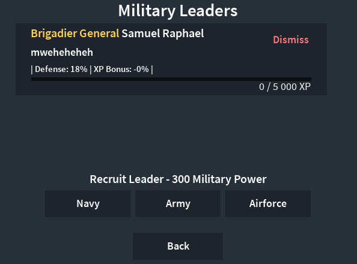
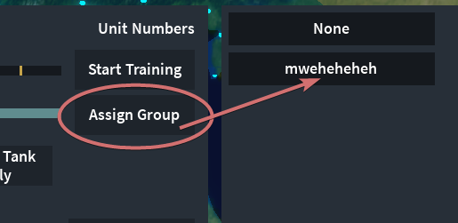

# UI Navigation
  
# Military Section
- If you click on doctrines, you can select what type of fighting your army does *only listing army types for right now, check back another time*
### Army
  - **Specialization**
  1. Manpower increases +0.4
  2. Infantry recruitment time 2x
  3. Infantry Starting Experience 1.75x (better fighters)
- **Massed Attack**
  1. Infantry recruitment time 0.75x
  2. Infantry Starting Experience 0.333x (worse fighters)
  3. Manpower increases 2x
# Military Groups
  - You can create multiple groups for free, this is for putting units (boats,infantry&tanks&artillery&anti-aircraft, and any airplane) to specialize or increase properties depending on the leader
# Military Leaders
- Making a leader will cost 300 Military Power
  1. The max military power you can have is 1.5k
  2. military power looks like this (see img2)
- Each leader comes with 1-3 perks that affect your units
- You can select a leader for each branch (army,navy,airforce) (this does not increase chances of perks)
- Click on the leader you made and then click on the group you made, this will assign the leader to your group
  - 
  - 
- Once you have your military group and are ready to give it to your units, select them and press assign group, and then press the group you have just created.
  - 
